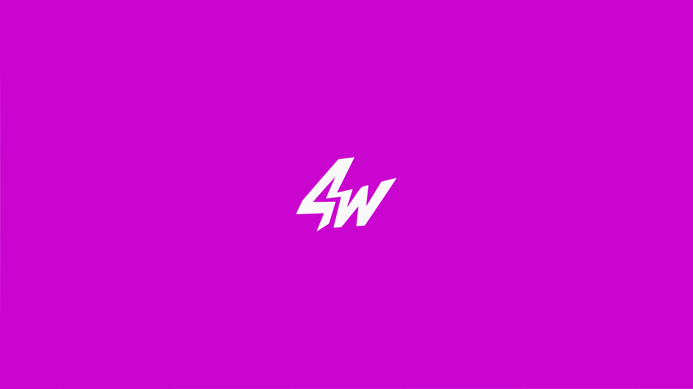

 

# WARRIS

### Founder · Product Builder · Developer · 4W Studio

Building software, gaming ecosystems, communities and digital products with **4W Studio**. ⚡

 

 

---

## 👋 About

I'm **Warris**, founder of **4W Studio**, building alongside **Wawax**.

We create and operate projects across **software, gaming, infrastructure and community**.

My work sits between engineering, product design and systems — from writing low-level code and automation to building complete products and user experiences.

> **Build things that feel simple on the surface and powerful underneath.**

---

## 🏢 4W Studio

**4W Studio** is the ecosystem Wawax and I are building together.

We work across several projects rather than a single product:

|     | Project                                                     |
| --- | ----------------------------------------------------------- |
| ⚡   | **4W Core** — Windows performance & optimization software   |
| 🎮  | **4W Gaming** — FiveM / gaming projects                     |
| 🌐  | **4W Team** — Community & ecosystem                         |
| 🛠️ | **4W Studio** — Software, infrastructure & digital products |

**Software · Gaming · Community · Infrastructure**

---

## ⚡ What I Do

🧠 **Product & System Design**
Designing products from architecture to the final user experience.

⚙️ **Performance & Optimization**
Windows, hardware, gaming performance and system-level optimization.

💻 **Software Development**
Desktop applications, tooling, automation and backend systems.

🎨 **UI / UX**
Building interfaces that are functional, dense and intentional — without unnecessary complexity.

🎮 **Gaming Ecosystems**
FiveM, gaming communities, servers and supporting infrastructure.

🚀 **Automation & Infrastructure**
Bots, services, APIs, deployment and internal tooling.

---

## 🧩 Tech Stack

### Languages

### Frameworks & Tools

---

## 📊 GitHub

 

---

## 📈 Contribution Activity

---

## 🏗️ Currently Building

### ⚡ 4W Core

A Windows performance platform focused on **optimization, stability and system control**.

Built around a serious engineering approach rather than a collection of random tweaks.

**Windows · Performance · Gaming · Hardware · UX**

### 🎮 4W Gaming

Gaming projects and infrastructure built around the **FiveM ecosystem**, servers and community experiences.

**FiveM · Lua · Infrastructure · Community**

### 🌐 4W Team

A community ecosystem bringing together developers, gamers, creators and people interested in technology and gaming.

---

## 🧠 Engineering Philosophy

> **Keep the experience simple.
> Keep the engineering serious.**

I don't want complexity to become the product.

The user should see a clean experience.

The complexity should stay where it belongs:

**behind the product.**

---

## 🌐 Connect

[🌐 **4W Core**](https://4wcore.com)
[💬 **4W Discord**](https://discord.gg/4wcore)

 

**Built with 4W Studio.**

